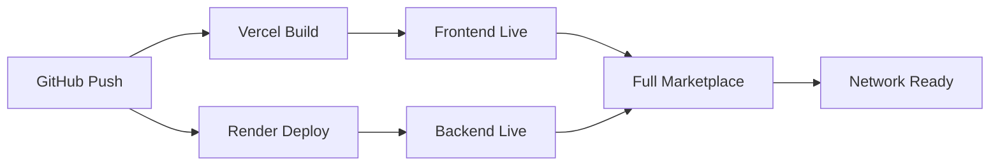

# 🚀 Deployment Status

## Current Infrastructure

### 📚 Repository (GitHub)
- **URL**: https://github.com/Traviseric/teneo-marketplace
- **Status**: ✅ Live
- **Branch**: `main` (protected)
- **Auto-Deploy**: Yes (triggers Vercel deployments)
- **Last Updated**: 2025-07-12

### 🎨 Frontend (Vercel)
- **URL**: https://teneo-marketplace.vercel.app (pending configuration)
- **Status**: 🔄 Setting Up
- **Framework**: Static files with Node.js API routes
- **Auto-Deploy**: Yes (from GitHub main branch)
- **Environment**: Production
- **CDN**: Global edge network
- **SSL**: Automatic HTTPS

### ⚙️ Backend (Render)
- **URL**: https://teneo-marketplace-api.onrender.com
- **Status**: ✅ Live
- **Service Type**: Web Service
- **Runtime**: Node.js 18+
- **Database**: SQLite with persistent storage
- **Environment**: Production
- **Auto-Deploy**: Yes (from GitHub main branch)

### 🌍 Network Federation
- **Status**: ⏳ Ready
- **Protocol**: REST API with JSON discovery
- **Registry**: Decentralized (no central authority)
- **Discovery**: Cross-store search and recommendations
- **First External Store**: Awaiting first adopter

## 📊 Deployment Pipeline

## 🔧 Configuration Status

| Component | Configured | Notes |
|-----------|------------|-------|
| Stripe Keys | ⏳ Pending | Need production keys for live payments |
| Email Service | ⏳ Pending | Need SMTP/SendGrid setup |
| Database | ✅ Ready | SQLite schema initialized |
| Environment | ✅ Ready | .env.example provided |
| SSL Certificates | ✅ Auto | Vercel + Render handle automatically |
| Domain Setup | ⏳ Optional | Custom domain can be configured |

## 📈 Performance Targets

| Metric | Target | Current |
|--------|--------|---------|
| Frontend Load Time | < 2s | Pending deployment |
| API Response Time | < 500ms | Pending deployment |
| Checkout Flow | < 5s | Pending configuration |
| PDF Download | < 3s | Pending testing |
| Uptime | 99.9% | Monitoring setup needed |

## 🛠 Next Steps

### Immediate (24 hours)
- [ ] Complete Vercel frontend deployment
- [ ] Finish Render backend deployment  
- [ ] Configure production environment variables
- [ ] Test full payment flow end-to-end
- [ ] Verify email delivery system

### Short Term (1 week)
- [ ] Set up monitoring and alerts
- [ ] Configure custom domain (optional)
- [ ] Optimize performance and caching
- [ ] Add health check endpoints
- [ ] Document deployment procedures

### Long Term (1 month)
- [ ] Scale infrastructure for high traffic
- [ ] Add backup and disaster recovery
- [ ] Implement advanced analytics
- [ ] Launch network growth campaign
- [ ] Onboard first external stores

## 📞 Support Contacts

| Issue Type | Contact | Response Time |
|------------|---------|---------------|
| Deployment Issues | GitHub Issues | 24 hours |
| Network Questions | network@teneo.ai | 48 hours |
| Technical Support | Discord #support | Real-time |
| Business Inquiries | partnerships@teneo.ai | 72 hours |

## 🎯 Success Metrics

### Phase 1: Launch (Complete)
- ✅ Code repository live on GitHub
- 🔄 Infrastructure deployment in progress
- ⏳ Production configuration pending

### Phase 2: Production (In Progress)
- [ ] First successful payment processed
- [ ] First book downloaded by customer
- [ ] Email delivery confirmed working
- [ ] All systems monitoring green
- [x] Backend API deployed and live
- [x] Frontend configured with live backend URL

### Phase 3: Network (Ready)
- [ ] First external store connects to network
- [ ] Cross-store discovery working
- [ ] Network effect demonstrated
- [ ] Community growth metrics positive

---

**Last Updated**: 2025-07-12  
**Next Review**: Weekly  
**Responsible**: Travis Eric / Teneo Network Team

> 🚀 **Ready to Deploy**: All infrastructure code is ready. Completing final configuration steps for live launch.